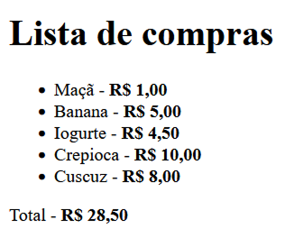
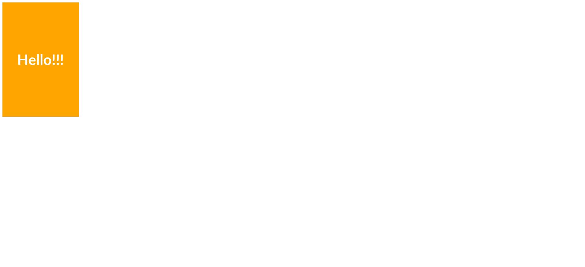
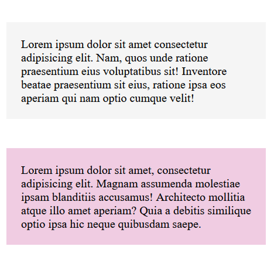

# 🧠 Exercícios de HTML e CSS Básico

Este repositório contém uma série de exercícios práticos desenvolvidos durante meus estudos iniciais em **HTML** e **CSS**.  
Cada pasta representa um mini projeto com foco em aprender e aplicar os conceitos fundamentais da construção de páginas web.

---

## 🗂️ Estrutura

```
📁 [1. Shopping list](./1.%20Lista%20de%20compras)
📁 [2. Image with link](./2.%20Imagem%20com%20link)
📁 [3. Colored paragraphs](./3.%20Paragrafos%20coloridos)
```

---

## 🔎 Descrição dos Exercícios

### 🛒 `Shopping list`

> Criação de uma lista de compras de alimentos saudáveis, com no  mínimo 3 itens e, ao lado de cada item, o preço (em negrito), utilizando listas não ordenadas (`<ul>`) e itens (`<li>`).  
> Ao final da lista, deve-se colocar o valor total dos produtos (em negrito).  
> Também explorei a estrutura básica do HTML e o uso de tags semânticas.




### 🖼️ `Image with link`

> Um exercício simples onde uma imagem é clicável e leva o usuário para um link externo (site do Google), abrindo em uma nova aba do navegador.  
> Pratiquei o uso da tag `<a>` combinada com ``, além de atributos como `target` e `alt`.



### 🎨 `Colored paragraphs`

> Estilização de parágrafos com cores diferentes usando CSS.  
> A ideia aqui foi entender melhor o **box model**, aplicar estilos com classes e brincar com propriedades como `background-color`, `margin` e `padding`.



---

## 🎯 Objetivo

> Este repositório é parte da minha jornada de transição de carreira para a área de tecnologia.  
> Estou aprendendo os fundamentos da web e evoluindo passo a passo rumo ao desenvolvimento **full stack**.  
> Cada exercício é uma pequena conquista no meu processo de aprendizagem. 🚀

---

## 🚀 Tecnologias

- HTML5
- CSS3
- Visual Studio Code

---

## ✨ Autora

Feito com carinho por **Aline M Miranda**  
👩‍💻 Estudante de programação | 🐶 Mãe da Zeiss | 🌙 Libriana em transição de carreira

[](https://github.com/aline-mmiranda)
[](https://www.linkedin.com/in/aline-mmiranda)

---

## 📌 Observações

> Estes exercícios são simples, mas representam meus primeiros passos como desenvolvedora.  
> O código pode (e vai) evoluir com o tempo, conforme avanço nos estudos. Feedbacks são super bem-vindos! 💜